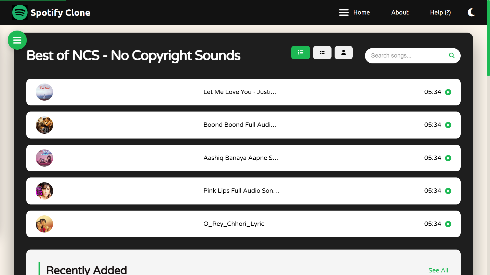

# 🎵 Spotify Clone - Premium Music Experience

A high-performance, responsive music player inspired by Spotify, featuring a modern glassmorphism design, real-time audio visualization, and a stationary navigation drawer. Built with vanilla HTML, CSS, and JavaScript.



## 🚀 Key Features

- **Stationary Navigation Drawer**: A professional `position: fixed` sidebar that stays pinned to the viewport, ensuring content is always accessible regardless of scroll depth.
- **Smart Toggle Interaction**: Animated hamburger menu that shifts into a red "Close" icon inside the drawer for a sleek, intuitive experience.
- **Real-Time Visualizer**: Dynamic audio frequency visualizer with high-quality cover art sync and artist name extraction.
- **Premium UI/UX**:
  - **Glassmorphism**: Elegant containers with `backdrop-filter: blur`.
  - **Dark Mode**: Optimized dark theme for late-night listening sessions.
  - **Micro-Animations**: Smooth scale transitions on song items and buttons.
- **SEO & Accessibility**:
  - **Semantic HTML**: Proper use of `nav`, `main`, `aside`, `section`, and `footer`.
  - **Dynamic Alt Text**: Every album cover automatically generates descriptive `alt` tags for screen readers.
  - **Skip Link**: "Skip to main content" for keyboard accessibility.

## ⌨️ Keyboard Shortcuts

| Key | Action |
| --- | --- |
| **Space** | Play / Pause |
| **Shift + N** | Next Song |
| **Shift + P** | Previous Song |
| **D** | Toggle Dark Mode |
| **Esc** | Close Sidebar Drawer |

## �️ Installation

1. Clone the repository:

   ```bash
   git clone https://github.com/kaushal-ka/Spotify.git
   ```

2. Open `index.html` in your favorite browser.
3. Start streaming premium NCS tracks!

## � Credits & License

- **Developer**: [kaushal-ka](https://github.com/kaushal-ka)
- **Audio Source**: NoCopyrightSounds (NCS)
- **License**: MIT License

---
Made with ❤️ by [kaushal-ka](https://github.com/kaushal-ka)
