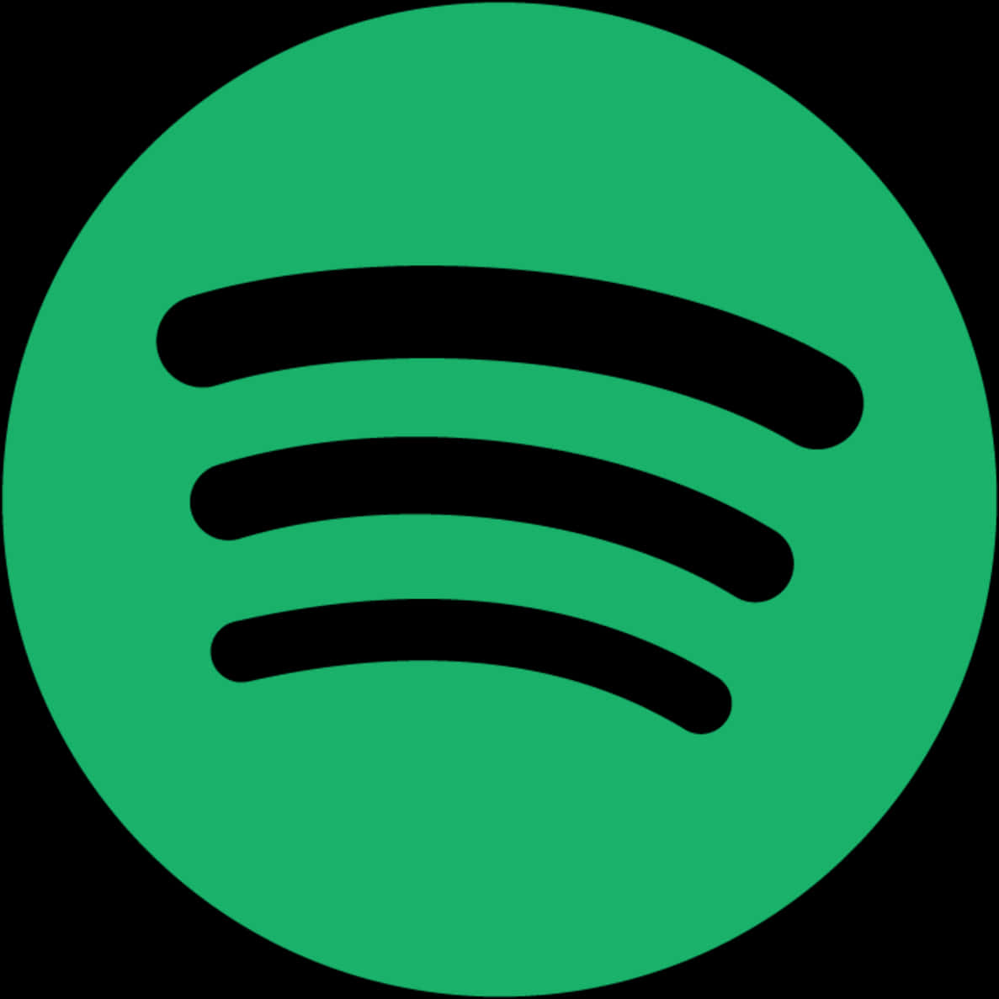

# Spotify Clone - Modern Web Music Player

# 🎵 Spotify Clone - Premium Music Player

A high-performance, responsive music player built with vanilla JavaScript, featuring real-time audio visualization, offline support (PWA), and a sleek Spotify-inspired interface.



## 🚀 Key Features

- **Real-time Audio Visualizer**: Dynamic frequency bars synced with your music.
- **Robust Playback Sync**: Centralized UI state management ensures visualizer, mini-player, and main controls are always in sync.
- **Progressive Web App (PWA)**: Installable on mobile and desktop for an app-like experience.
- **Responsive Layout**: Fluid design that works perfectly on everything from tiny phones to ultra-wide monitors.
- **Smart Song Info**: Automatic metadata parsing for song titles and artists.
- **Interactive UI**: Glassmorphism effects, premium transitions, and custom themed scrollbars.
- **Full Control**: Volume, shuffle, repeat (All/One), and keyboard shortcuts.
- **Dark Mode**: Native system-synced dark mode support.

## ⌨️ Keyboard Shortcuts

| Key | Action |
|-----|--------|
| `Space` | Play / Pause |
| `→` | Next Song |
| `←` | Previous Song |
| `S` | Toggle Shuffle |
| `R` | Toggle Repeat Mode |
| `L` | Like / Favorite |
| `D` | Toggle Dark Mode |
| `?` | View Help Modal |

## 🛠️ Technology Stack

- **Frontend**: HTML5, CSS3 (Vanilla), JavaScript (ES6+)
- **Audio Engine**: Web Audio API
- **Icons**: FontAwesome 6
- **Offline**: Service Workers & Cache Storage API (PWA)
- **Design**: CSS Grid, Flexbox, Glassmorphism, Responsive Design

## 📦 Installation & Setup

1. **Clone the repository**:
   ```bash
   git clone https://github.com/yourusername/spotify-clone.git
   ```
2. **Open the project**:
   Open `index.html` in any modern web browser.
3. **PWA Installation**:
   Click the "Install" icon in your browser's address bar to add to your home screen.

## 📄 License

This project is licensed under the MIT License - see the [LICENSE](LICENSE) file for details.

---
Crafted with ❤️ for a premium music experience.